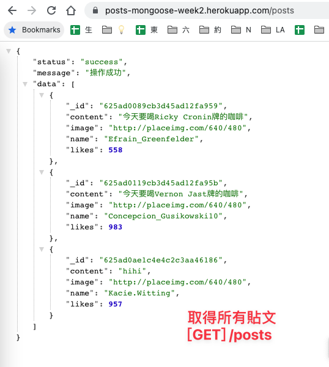

<div align="center">
  <a href="https://github.com/Hazelwu2/posts-mongoose-week2.git">
    
  </a>

  <h3 align="center">Post List</h3>

  <p align="center">
    🌱 貼文動態牆 API in Node.js
    <br />
    <a href="https://github.com/Hazelwu2/posts-mongoose-week2/issues">Report Bug</a>
    ·
    <a href="https://posts-mongoose-week2.herokuapp.com/posts">Demo</a>
  </p>
</div>

## 🛖 About This Project
第二週六角學院 Nodejs 主線任務，設計一個 /posts 路由，設計與 todolist kata 一樣的設計

* 上傳 [GitHub](https://github.com/Hazelwu2/posts-mongoose-week2.git)
* 提供 [POSTMAN](https://github.com/Hazelwu2/posts-mongoose-week2/blob/main/Post-Mongoose.postman_collection.json)
* config.env 忽略，不能在 GitHub 上：以.env取代
* 請連接 mongodb 雲端 atlas 資料庫
* dotenv 加上環境變數，讓程式更安全
* 部署到 [heroku 主機](https://posts-mongoose-week2.herokuapp.com/)

API 規格
<div align="center">
<a href="https://github.com/Hazelwu2/posts-mongoose-week2.git/posts">
  
</a>
</div>

* Create：建立 Post 貼文，[POST] /posts/
* Read：閱讀 Post 貼文，[GET] /posts/
* Edit：編輯 Post 貼文，[GET] /posts/{id}
* Delete：刪除單篇 Post 貼文，[DELETE] /posts/{id}
* Delete：刪除所有 Post 貼文，[DELETE] /posts/


## 🔨 Built With
此專案會用到的 Framework / Library 或工具

* [Nodejs](https://github.com/nodejs)
* [Heroku](https://www.heroku.com/)
* [Git](https://git-scm.com/)
* [Nodemon](https://www.npmjs.com/package/nodemon)
* [Mongoose](https://mongoosejs.com/)
* [dotenv](https://www.npmjs.com/package/dotenv)

## 👨‍💻 Getting Started
以下照著範例做，可以讓你在本地端 run 此專案

1. Clone the Repo
  ```sh
    git clone git@github.com:Hazelwu2/posts-mongoose-week2.git
  ```
2. Install NPM packages
  ```
  cd posts-mongoose-week2
  npm install
  ```
3. Setup .env to connect DB
  ```
  cp .env.example .env
  設定 .env 參數 DB_URL, DB_PASSWORD，遠端資料庫使用 MongoDB Atlas
  ```

3. Start Runing Server
  ```
  npm run dev
  ```
4. Deploy to heroku
  ```
  herku create posts-mongoose-week2
  git push heroku main
  ```
5. Setting Heroku Variable
  ```
  Project/Settings
  Config Vars Add "DB_URL", "DB_PASSWORD"
  ```
6. DEBUG in Heroku
  ```
  heroku logs --tail
  ```


## 📕 Mongoose CRUD Syntax
- 新增：Model.create()
- 刪除：Model.findByIdAndDelete()
- 更新：Model.findByIdAndUpdate()
- 查詢：Model.find()